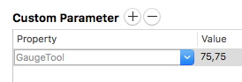

# GaugeTool.glyphsTool

This is a plugin for [Glyphs App](http://glyphsapp.com/). Shout out to [Dinamo](http://www.dinamo.us) for the idea and Georg Seifert (@schriftgestalt) for code and assistance!

The tool shows an oval as the mouse cursor which can be used to gauge the width of strokes. The size of this oval is set in the dimensions palette for uppercase and lowercase letters and for the rest as a custom master parameter named "GaugeTool" (format: "width,height") in under Font Info.

There are 2 tools nested under the toolbar icon: the straight stem (＋) and round stem tool (○) – to change tools, press Shift+C. 

 

The straighs stem tool draws a blue oval and and the round stem a green oval. These use their respective values in the dimensions palette: the straight stem tool uses H for uppercase and n for lowercase, the round stem tool uses O and o.

If the current glyph is neither a lowercase or uppercase letter the tool will use the value set in the "GaugeTool" custom parameter and display an asterisk (✳) in the oval. When the tool is using the custom parameter measurements, the oval is red.

### Usage Instructions

1. Open a glyph in Edit View.
2. Enter your font's measurements in the Dimensions palette, for 'H', 'O', 'n' and 'o'. Also create a custom Master parameter called "GaugeTool" for backup dimensions in the format "width,height", i.e. "75,75"
3. Use C or Shift+C to toggle the tool.

### Installation

1. Download the complete ZIP file and unpack it, or clone the repository.
2. Double click the .glyphsTool file. Confirm the dialog that appears in Glyphs.
3. Restart Glyphs

### Requirements

Latest version tested with Glyphs App Version 2.3.1 (903).

The plugin needs Glyphs 2.0 or higher, running on OS X 10.9 or later. It does NOT work with Glyphs 1.x.

### License

2016–2018 Wei Huang (@weiweihuanghuang).
Based on sample code by Georg Seifert (@schriftgestalt).
Idea from [Dinamo](http://www.dinamo.us).

Licensed under the Apache License, Version 2.0 (the "License");
you may not use this file except in compliance with the License.
You may obtain a copy of the License at

http://www.apache.org/licenses/LICENSE-2.0

See the License file included in this repository for further details.